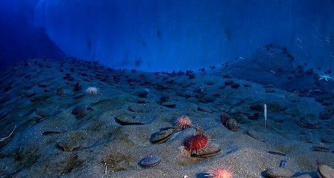

이 블로그에서의 생존 역시 실패한다면, 원인에 대해 꼼꼼히 기록 후 깃헙 레포지토리는 잘 아카이빙 하여 다음 탐사에 유용하게 쓸 수 있도록 기록하기를 바람

> 인류는 늘 글쓰기를 탐해왔다. 
>  하지만 그들의 중력에 약한 신체와 최대한 칼로리 소모를 줄이고 싶은 뇌는 그저 본체가 계속해서 누워있기를 바랄 뿐이다.
>  새해 벽두에 급속히 증가한 새로운 블로그와 글에 대한 약속은, 채 2월이 가기 전에 허무하게 스러져 웹 깊은 곳에 잠들어 누군가의 양분이 되고 있을 터이다. 

.
